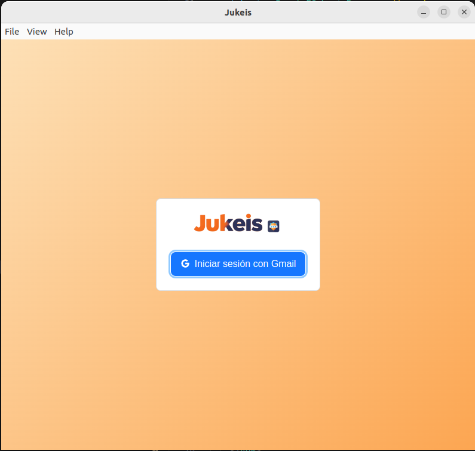
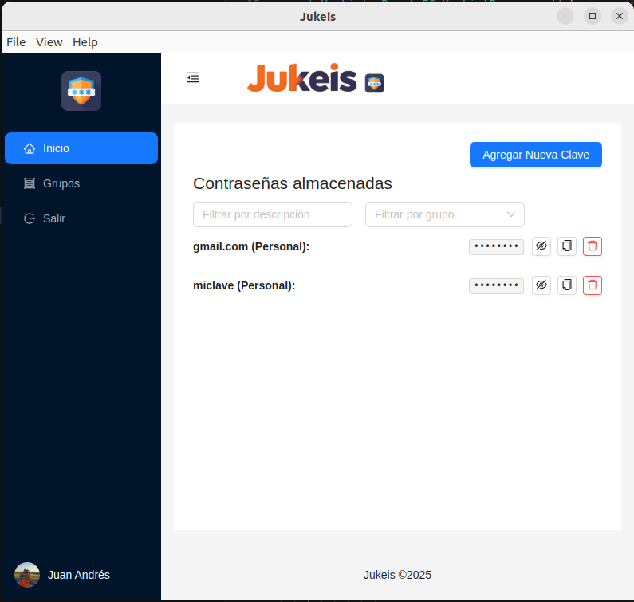
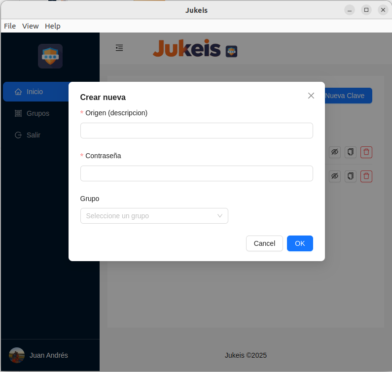

# Jukeis - Your Secure Password Storage

<div style="text-align: center">
  
</div>

<br />

<p>
Jukeis is a secure and easy-to-use desktop application for storing and managing your passwords locally. Forget having to remember multiple complex keys: with Jukeis, you only need to remember one master password to access all the others.
</p>

 [](https://opensource.org/licenses/MIT)
[](https://www.electronjs.org/)
[](https://www.electronjs.org/)
[](https://shields.io/) 

## Table of Contents

- [Key Features](#key-features)
- [Screenshots](#screenshots)
- [Getting Started](#getting-started)
  - [Prerequisites](#prerequisites)
  - [Installation](#installation)
  - [Running](#running)
- [Usage](#usage)
  - [Creating a Vault](#creating-a-vault)
  - [Adding New Passwords](#adding-new-passwords)
  - [Viewing and Copying Passwords](#viewing-and-copying-passwords)
  - [Organizing with Groups](#organizing-with-groups)
- [Technologies Used](#technologies-used)
- [Contributing](#contributing)
- [License](#license)
- [Contact](#contact)
- [Acknowledgments](#acknowledgments)

## Key Features

* **Secure Storage:** Your passwords are stored locally and securely, protected by a master password.
* **Robust Encryption:** Implementation of modern encryption algorithms to protect your sensitive data. *(Specify the algorithm if you wish)*
* **Intuitive Interface:** Clean and user-friendly design, based on Ant Design components.
* **Group Organization:** Allows you to organize your passwords into logical groups (e.g., Social Media, Emails, Banking).
* **Password Generator:** Integrated tool to create strong and unique passwords. *(If you implemented it)*
* **Secure Authentication:** Login process to access your password vault.
* **Cross-Platform Compatibility:** Works on Windows, macOS, and Linux thanks to Electron.
* **Quick Search:** Find your passwords quickly with the search function. *(If you implemented it)*
* **Easy Copying:** Option to securely copy passwords to the clipboard.

## Screenshots

*[Here you could add some screenshots of the application in action. This visually helps users understand what Jukeis looks like.]*

### Login Screen



### Password List



### Add New Password Form




## Getting Started

Follow these steps to install and run Jukeis on your system.

### Prerequisites

* **Node.js** (version >= 16.0.0 recommended): Required to run development scripts and build the application. You can download it from [https://nodejs.org/](https://nodejs.org/).
* **npm** or **yarn**: Package managers for Node.js. They usually come installed with Node.js.

#### Environment Variables

To run this project, you will need to add the following environment variables to your .env file else the project will fail


`GOOGLE_CLIENT_ID` your google client id (you must create an application at https://console.cloud.google.com/)

`GOOGLE_CLIENT_SECRET` your google client secret app

`GOOGLE_REDIRECT_URI` redirect callback for Oauth2

`ENCRYPTION_KEY` encription hash master key Example: 'fBcDeFgHiJKLmNooqZsTuVwXyZ019124'


### Installation

1.  **Clone the repository (if it's open source):**
    ```bash
    git clone <REPOSITORY_URL>
    cd jukeis-app-erb
    ```

2.  **Install dependencies:**
    If you use npm:
    ```bash
    npm install
    ```
    If you use yarn:
    ```bash
    yarn install
    ```

### Running

1.  **To run in development mode (with hot-reloading):**
    ```bash
    npm run dev
    # or
    yarn dev
    ```
    This will open the Jukeis application in an Electron window with developer tools active.

2.  **To build the application for production:**
    ```bash
    npm run build
    # or
    yarn build
    ```
    This command will generate the packaged application files for your operating system in a `dist` folder or similar.

3.  **To run the built application:**
    Navigate to the folder where the packaged application was generated (`dist` or similar) and run the executable file (e.g., `Jukeis` on Linux/macOS or `Jukeis.exe` on Windows).

## Usage

Once you have run Jukeis, these are the basic steps to start using it:

### Creating a Vault

* On the first launch, you will be prompted to create a **master password**. Remember this password well, as it will be the key to access all your other passwords!
* Jukeis will create a local password vault protected by this master password.

### Adding New Passwords

1.  Click the "Add Password" button (or a similar icon).
2.  Fill out the form with the following information:
    * **Title:** A descriptive name for the password (e.g., "Gmail", "Facebook").
    * **Password:** The password you want to save. *(Optionally, you can use the password generator if you implemented it)*
    * **Group:** Select or create a group to organize this password.
    * **Notes (Optional):** Any additional information you want to save.
3.  Click "Save".

### Viewing and Copying Passwords

1.  Select the password you want to view from the list.
2.  For security, you may need to re-enter your master password to reveal the passwords.
3.  Once revealed, you will be able to see the password.
4.  Click the "Copy" button (usually a clipboard icon) to copy the password to the clipboard. Remember that for security, the copied password might disappear from the clipboard after a while!

### Organizing with Groups

* You can create new groups to organize your passwords (e.g., "Work", "Personal", "Banks").
* When adding or editing a password, you can assign it to a specific group.
* The interface might allow you to filter or browse your passwords by group.

## Technologies Used

* **Electron:** Framework for building cross-platform desktop applications with JavaScript, HTML, and CSS.
* **ERB:** Electron React Boilerplate.
* **React:** JavaScript library for building user interfaces.
* **Ant Design:** UI component library for React that provides a set of ready-to-use and styled components.
* **[Other Libraries/Frameworks you used]:** (e.g., `react-router-dom`, any encryption library, etc.)

## Contributing

Contributions are welcome. If you find any bugs or have any suggestions for improvement, please open an [issue](https://github.com/your-username/Jukeis/issues) on the GitHub repository.

If you want to contribute code, please follow these steps:

1.  Fork the repository.
2.  Create a feature branch (`git checkout -b feature/new-feature`).
3.  Commit your changes (`git commit -m 'Add new feature'`).
4.  Push to the branch (`git push origin feature/new-feature`).
5.  Open a [pull request](https://github.com/your-username/Jukeis/pulls) on the original repository.

## License

This project is licensed under the [MIT License](https://opensource.org/licenses/MIT). See the `LICENSE` file in the root of the repository for more details.

## Author

- [Juan Andrés Carmena](https://github.com/jcdesignweb)

You can contact me via [Gmail](juan14nob@gmail.com) or [Linkedin](https://www.linkedin.com/in/jcarmena/).


